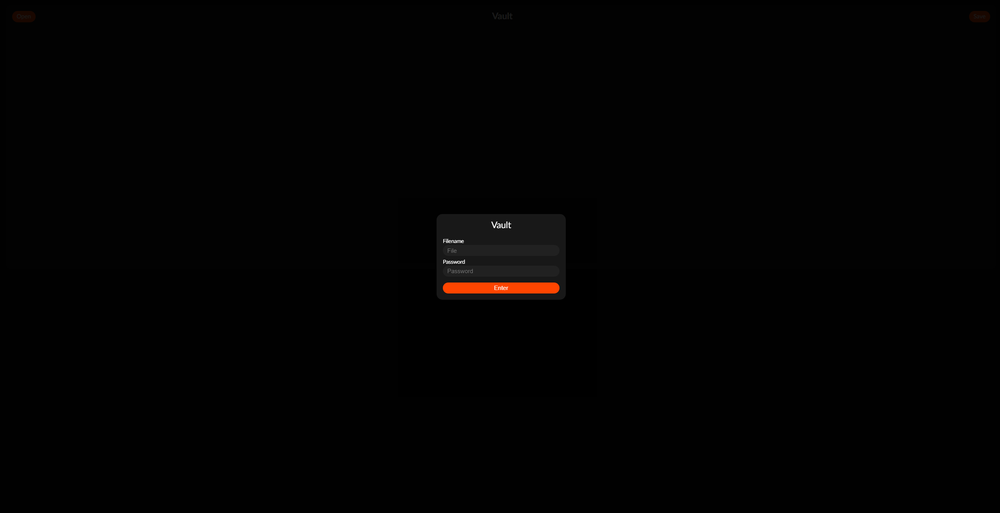
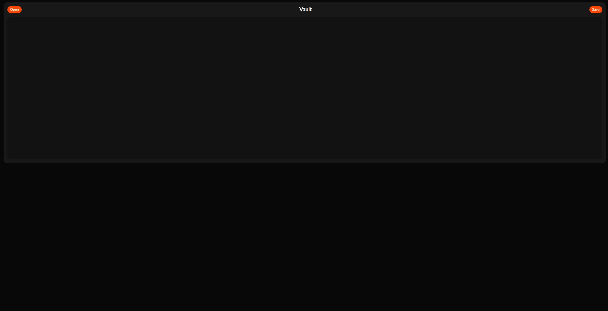

# Vault

[](https://forthebadge.com)
[](https://forthebadge.com)

Vault is a self-hosted project that allows you to store sensitive text in a secure way. It uses [Argon2](https://en.wikipedia.org/wiki/Argon2) for password hashing and key derivation and encrypts the data symmetrically with AES-256, the user's password is not saved at all, only the encrypted data with the generated salt. I wouldn't recommend using it in a real production environment but it's useful for keeping your secrets (or diary) safe from the general public.




## Getting Started

### Manually

- Get [Go](https://go.dev/dl/)
- (Optional) Get [Taskfile](https://taskfile.dev)
- Open a terminal and run:

```bash
git clone https://github.com/DarkCeptor44/vault.git
cd vault


# without Taskfile
go build .
./vault # if on Windows, use .\vault.exe

# with Taskfile
task
```

### Docker

You can find a Docker image [here](https://hub.docker.com/r/darkceptor44/vault):

```bash
docker run -d --name vault -p 8080:8080 -v ./data:/app/documents -v /etc/localtime:/etc/localtime:ro --restart unless-stopped darkceptor44/vault
```

Or build it yourself:

```bash
docker build -t vault . --no-cache
docker run -d --name vault -p 8080:8080 -v ./data:/app/documents -v /etc/localtime:/etc/localtime:ro --restart unless-stopped vault
```

### Docker Compose

You can find a `compose.yml` file [here](compose.yml):

```yaml
services:
  vault:
    image: darkceptor44/vault:latest
    container_name: vault
    ports:
      - 8080:8080
    environment:
      - HOST=0.0.0.0  # optional
      - PORT=8080  # optional unless using a different port
      - DOCKER=yes  # optional
      - DEBUG=yes  # if debug needed
    volumes:
      - ./data:/app/documents # where data will be stored
      - /etc/localtime:/etc/localtime:ro # for correct timezone when logging
    restart: unless-stopped
```

## Environment Variables

If needed you can make a `.env` file in the root of the repo and put some env variables in there, the following are supported:

| Variable | Description | Default |
|----------|-------------|---------|
| `HOST` | Host the server binds to | `0.0.0.0` |
| `PORT` | Port the server listens on | `8080` |
| `DOCKER` | Tells the server it's running in a Docker container | `yes` if built the image with provided `Dockerfile` |
| `DEBUG` | Tells the server to print debug messages, requests and to enable `pprof` | `no` |

## Disclaimer

- This project was made for personal use and learning purposes, there could be vulnerabilities.
- Since the user's password is not saved it is up to the user to choose a secure password and if anything happens (say it refuses to decrypt) the data is lost.
- This project was made mostly in a private self-hosted Git instance and that's why there are only a few commits.

## License

This project is licensed under the GNU General Public License v3.0 (GPLv3), you can check the license here: [LICENSE](LICENSE).
